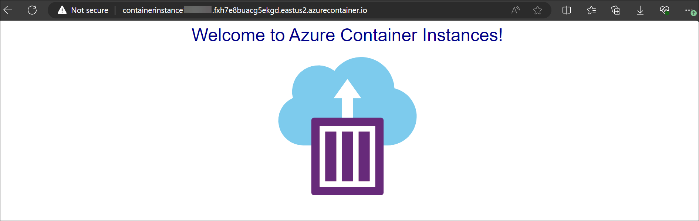

# Lab 03a - Implement Azure Container Instances

## Lab Overview

This lab focuses on deploying and managing Docker containers using Azure Container Instances (ACI). In this lab, you will learn how to deploy a Docker image onto Azure Container Instances, which offers a simple and efficient way to run containers without needing to manage the underlying infrastructure.

## Lab objectives

In this lab, you will complete the following tasks:

- Task 1: Deploy an Azure Container Instance using a Docker image
- Task 2: Review the functionality of the Azure Container Instance

### Task 1: Deploy an Azure Container Instance using a Docker image

In this task, you will create a new Azure Container Instance (ACI) for hosting a web application. Azure Container Instances allow you to run containers in the cloud without the need to manage the underlying virtual machines or infrastructure.

1. In the Azure portal, search for locate **Container instances**.

    
   
1. On the **Container instances** blade, click **+ Create**.

1. On the **Basics** tab of the **Create container instance** blade, specify the following settings (leave others with their default values) and Click **Next: Networking > (7)**

    | Setting | Value |
    | ---- | ---- |
    | Subscription | Leave it as default **(1)** |
    | Resource group | Select **az104-09b-rg1 (2)** |
    | Container name | **az104-9b-c1 (3)** |
    | Region | **<inject key="Region" enableCopy="false" /> (4)** |
    | Image Source | **Quickstart images (5)** |
    | Image | **mcr.microsoft.com/azuredocs/aci-helloworld:latest (Linux) (6)** |

    

1. On the **Networking** tab of the **Create container instance** blade, specify the following settings (leave others with their default values) and  click on **Next: Monitoring >**:

    | Setting | Value |
    | --- | --- |
    | DNS name label | any valid, globally unique DNS hostname |

    

    >**Note**: Your container will be publicly reachable at dns-name-label.region.azurecontainer.io. If you receive a **DNS name label not available** error message, specify a different value.

1. Uncheck **Enable container instance logs**. 

1. Click **Next: Advanced** review the settings on the Advanced tab of the Create container instance blade without making any changes, click **Review + Create**, ensure that the validation passed and click **Create**.

    >**Note**: Wait for the deployment to complete. This should take about 3 minutes.

    >**Note**: While you wait, you may be interested in viewing the [code behind the sample application](https://github.com/Azure-Samples/aci-helloworld). To view it, browse the \\app folder.

### Task 2: Review the functionality of the Azure Container Instance

In this task, you will review the deployment of the Azure Container Instance (ACI) to ensure it is running correctly and accessible. 

1. On the deployment blade, click the **Go to resource** link.

1. On the **Overview** blade of the container instance, verify that **Status** is reported as **Running**.

   

1. Copy the value of the container instance **FQDN**, open a new browser tab, and navigate to the corresponding URL.

    

1. Verify that the **Welcome to Azure Container Instance** page is displayed.

    

1. Close the new browser tab, back in the Azure portal, in the **Settings** section of the container instance blade, click **Containers (1)**, and then click **Logs (2)**.

    

1. Verify that you see the log entries representing the HTTP GET request generated by displaying the application in the browser.

   > **Congratulations** on completing the task! Now, it's time to validate it. Here are the steps:
   > - Hit the Validate button for the corresponding task. If you receive a success message, you can proceed to the next task. 
   > - If not, carefully read the error message and retry the step, following the instructions in the lab guide.
   > - If you need any assistance, please contact us at labs-support@spektrasystems.com. We are available 24/7 to help
   
   <validation step="bc3f7679-1e22-449c-b128-1561d970a81d" />

### Review

In this lab, you have completed the following :

- Deployed a Docker image by using the Azure Container Instance
- Reviewed the functionality of the Azure Container Instance

### You have successfully completed the lab
