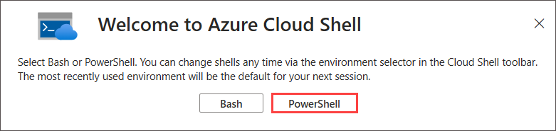
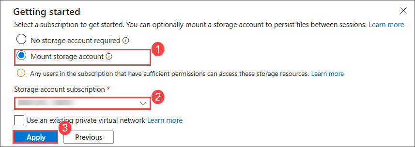
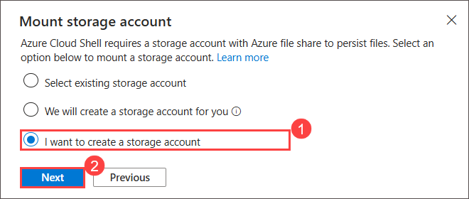
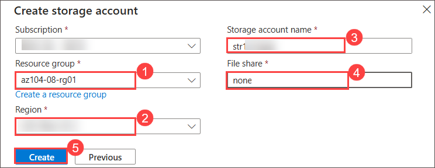
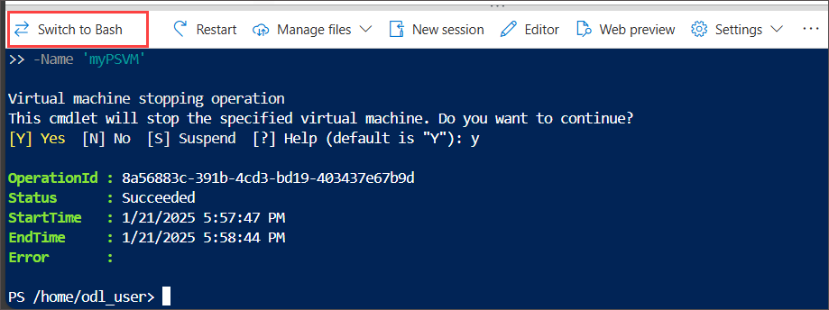
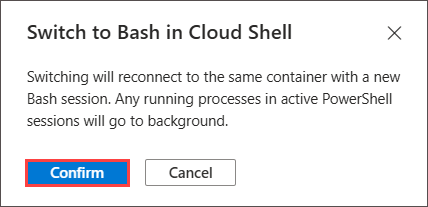
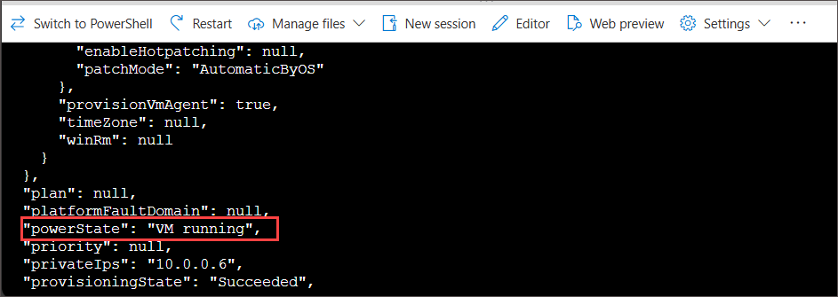
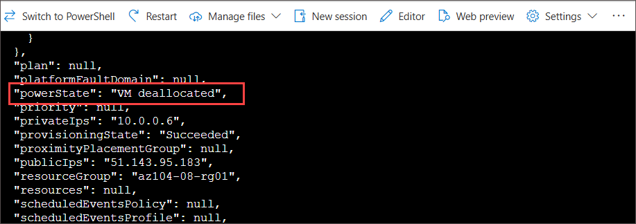

# Lab 01 a - Manage Azure Resources Using PowerShell

## Lab Overview

This lab focuses on managing Azure Resources Using PowerShell which involves automating and managing Azure services and infrastructure via PowerShell cmdlets.

## Lab objectives

In this lab, you will complete the following tasks:

+ Task 1: Create a virtual machine using Azure PowerShell .
+ Task 2: Create a virtual machine using the CLI.

## Exercise 1: Administer Azure resources with PowerShell.

In this exercise, you will learn how to administer Azure resources with PowerShell by automating tasks such as provisioning, configuring, and managing services.

## Task 1: Create a virtual machine using Azure PowerShell 

1. On the Azure portal, select the **Cloud shell** (**[>_]**)  button at the top of the page to the right of the search box. This opens a cloud shell pane at the bottom of the portal.

   

1. The first time you open the Cloud Shell, you may be prompted to choose the type of shell you want to use (*Bash* or *PowerShell*). If so, select **PowerShell**.

     
   
1. On **Getting started** window choose **Mount storage account** then under **Storage account subscription** select your available subscription from the dropdown and click on **Apply**.

     

1. Within the Mount storage account pane, select **I want to create a storage account** and click **Next**. 

      
   
    >**Note:** As you work with the Cloud Shell a storage account and file share is required. 

1. Specify the following then click on **Create**.
   
    | Settings | Values |
    |  -- | -- |
    | Resource Group | **az104-08-rg01** |
    | Region         | **<inject key="Region" enableCopy="false"/>** |
    | Storage account name | **str<inject key="DeploymentID" enableCopy="false" />** |
    | File share  | **none** |

     

1. Run the following command to create a virtual machine. When prompted, provide a username and password for the VM. While you wait check out the [New-AzVM](https://learn.microsoft.com/powershell/module/az.compute/new-azvm?view=azps-11.1.0) command reference for all the parameters associated with creating a virtual machine.

    ```powershell
    New-AzVm `
    -ResourceGroupName 'az104-08-rg01' `
    -Name 'myPSVM' `
    -Location 'East US' `
    -Image 'Win2019Datacenter' `
    -Zone '1' `
    -Size 'Standard_D2s_v3' ` 
    -Credential (Get-Credential)
    ```

1. Once the command completes, use **Get-AzVM** to list the virtual machines in your resource group.

    ```powershell
    Get-AzVM `
    -ResourceGroupName 'az104-08-rg01' `
    -Status
    ```

1. Verify your new virtual machine is listed and the **Status** is **Running**.

    

1. Use **Stop-AzVM** to deallocate your virtual machine. Type **Yes** to confirm.

    ```powershell
    Stop-AzVM `
    -ResourceGroupName 'az104-08-rg01' `
    -Name 'myPSVM' 
    ```

1. Use **Get-AzVM** with the **-Status** parameter to verify the machine is **deallocated**.

    >**Did you know?** When you use Azure to stop your virtual machine, the status is *deallocated*. This means that any non-static public IPs are released, and you stop paying for the VM’s compute costs.

## Task 2: Create a virtual machine using the CLI 

1. Select the icon (top left ) **Switch to bash** and Confirm when prompted.

   

   

1. Run the following command to create a virtual machine. When prompted, provide a username and password for the VM. While you wait check out the [az vm create](https://learn.microsoft.com/cli/azure/vm?view=azure-cli-latest#az-vm-create) command reference for all the parameters associated with creating a virtual machine.

    ```sh
    az vm create --name myCLIVM --resource-group az104-08-rg01 --image Win2019Datacenter --admin-username localadmin --generate-ssh-keys
    ```
   >**Note**: Give Admin password as **Password.1!!** and Password will be not visible
   
1. Once the command completes, use **az vm show** to verify your machine was created.

    ```sh
    az vm show --name  myCLIVM --resource-group az104-08-rg01 --show-details
    ```

1. Verify the **powerState** is **VM Running**.

    

1. Use **az vm deallocate** to deallocate your virtual machine.

    ```sh
   az vm deallocate --resource-group az104-08-rg01 --name myCLIVM
    ```

1. Use **az vm show** to ensure the **powerState** is **VM deallocated**.

    ```sh
    az vm show --name  myCLIVM --resource-group az104-08-rg01 --show-details
    ```

    
   
  >**Did you know?** When you use Azure to stop your virtual machine, the status is *deallocated*. This means that any non-static public IPs are released, and you stop paying for the VM’s compute costs.

## Review

In this lab we have provisioned Azure resource using powershell and CLI.

## Extend your learning with Copilot
Copilot can assist you in learning how to use the Azure scripting tools. Copilot can also assist in areas not covered in the lab or where you need more information. Open an Edge browser and choose Copilot (top right) or navigate to *copilot.microsoft.com*. Take a few minutes to try these prompts.

+ Provide the steps and the Azure CLI commands to create a Linux virtual machine. 
+ Review the ways you can scale virtual machines and improve performance.
+ Describe Azure storage lifecycle management policies and how they can optimize costs.

## Learn more with self-paced training

+ [Create a Windows virtual machine in Azure](https://learn.microsoft.com/training/modules/create-windows-virtual-machine-in-azure/). Create a Windows virtual machine using the Azure portal. Connect to a running Windows virtual machine using Remote Desktop
+ [Build a scalable application with Virtual Machine Scale Sets](https://learn.microsoft.com/training/modules/build-app-with-scale-sets/). Enable your application to automatically adjust to changes in load while minimizing costs with Virtual Machine Scale Sets.
+ [Connect to virtual machines through the Azure portal by using Azure Bastion](https://learn.microsoft.com/en-us/training/modules/connect-vm-with-azure-bastion/). Deploy Azure Bastion to securely connect to Azure virtual machines directly within the Azure portal to effectively replace an existing jumpbox solution, monitor remote sessions by using diagnostic logs, and manage remote sessions by disconnecting a user session.

## Key takeaways

Congratulations on completing the lab. Here are the main takeaways for this lab.

+ Azure virtual machines are on-demand, scalable computing resources.
+ Azure virtual machines provide both vertical and horizontal scaling options.
+ Configuring Azure virtual machines includes choosing an operating system, size, storage and networking settings.
+ Azure Virtual Machine Scale Sets let you create and manage a group of load balanced VMs.
+ The virtual machines in a Virtual Machine Scale Set are created from the same image and configuration.
+ In a Virtual Machine Scale Set the number of VM instances can automatically increase or decrease in response to demand or a defined schedule.

### You have successfully completed the lab


